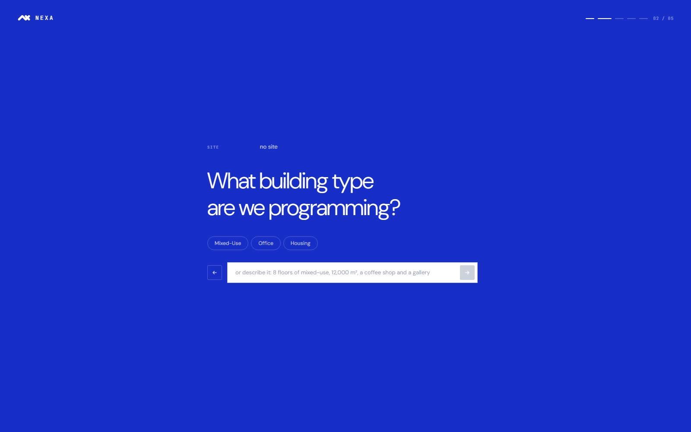
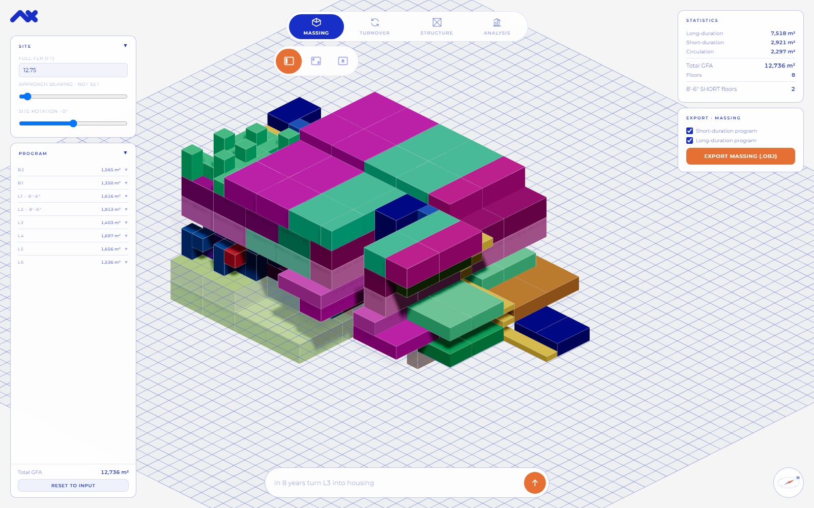
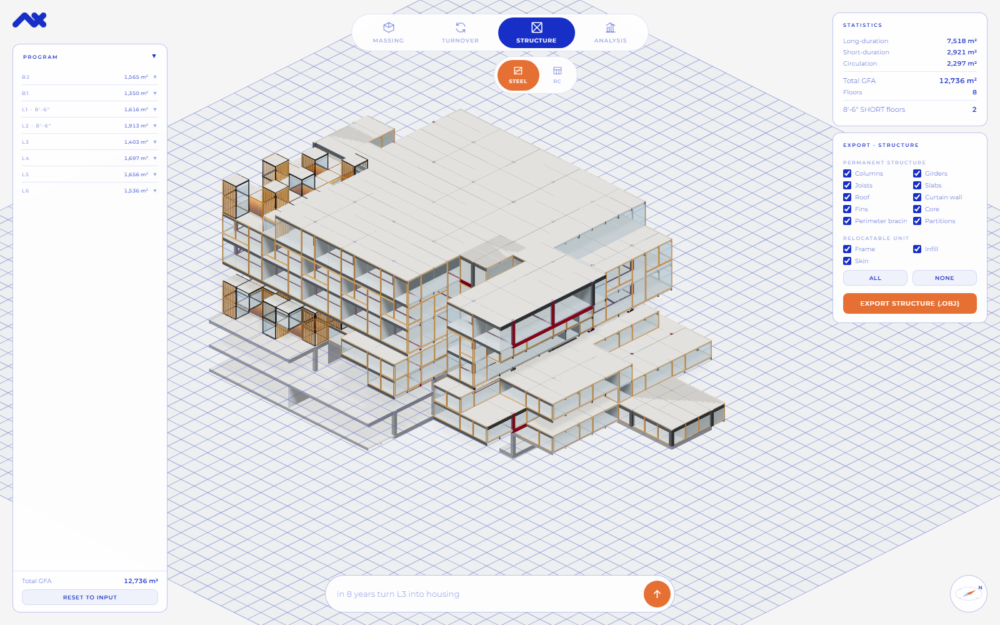
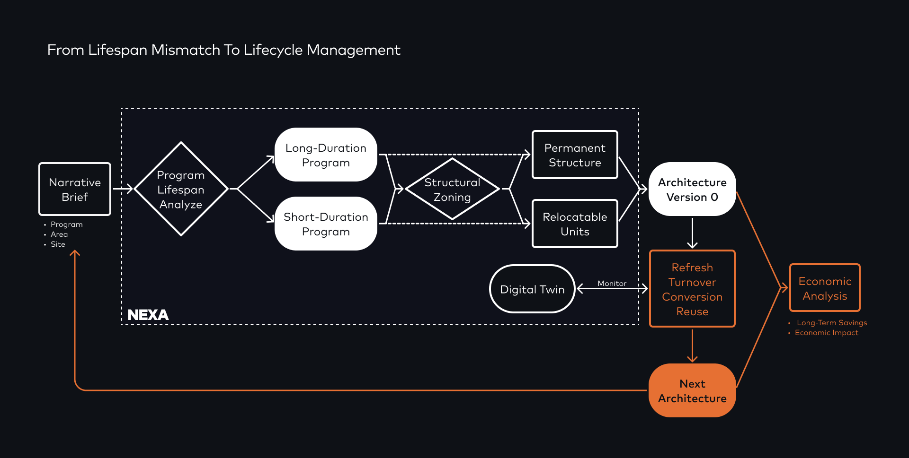

# NEXA

**A browser tool for programming a building around the fact that its uses change faster than its frame.**

A restaurant lasts a few years. An office fit-out maybe five to ten. The structure stands
for fifty to a hundred. NEXA treats that gap as the design problem. It splits a brief into
long-duration and short-duration program, gives the long part a permanent structure and the
short part a plug-in 8'-6" module system, then shows what happens when a use turns over.

You describe a building in plain language. It lays out the massing, the module system and a
hybrid structure, in the browser, with no install.

**Live: https://jckian.github.io/NEXA/**

> SCI-Arc Spring 2026 research by Yenhsing Cheng.

---

## What it looks like

Five questions: site, type, GFA, floors, activities. Chips or a sentence, either works.



The program lands as massing, coloured by program category. The panel splits the area into
long-duration, short-duration and circulation, and the level list marks which floors are
8'-6" plug-in band.



The same building as structure: permanent frame, slabs, core and curtain wall, with the
relocatable units sitting inside it. Both views export to OBJ.



---

## Why it exists

Design tools cover one stage of a building's life each, and most are closed and expensive:

| Tool | Covers | Stops at |
|---|---|---|
| Modular platforms (Gropyus, AUAR) | How a building is built | Handover |
| Circular tools (Madaster) | Material records | Doesn't generate adaptive systems |
| Digital twins (Autodesk Tandem) | Monitoring | Can't reconfigure |

NEXA runs adaptive design, program-lifespan logic and reuse as one continuous loop, and
does it in the open so students and small practices can use and extend it.

---

## Workflow



A narrative brief (program, area, site) is read for program lifespan and split into
long-duration and short-duration. Structural zoning resolves those into a permanent
structure and relocatable units, giving Architecture Version 0. From there a digital twin
monitors the building and drives refresh, turnover, conversion and reuse, feeding an
economic analysis that loops back into the next architecture.

---

## What's here

Every app is a single HTML file on CDN Three.js. No build step. Open it in a browser.

| File | What it does |
|---|---|
| `index.html` | Redirect. Sends the bare site URL to `NEXA-site.html`. |
| `NEXA-site.html` | Project site: concept, pipeline, program lifespan, design for disassembly. The front door. |
| `NEXA-system.html` | The kit of parts: frame, infill, connection. |
| `program-input.html` | The wizard. Five questions, then a program you can edit before it goes downstream. |
| `program-massing-shortfloor.html` | The visualizer. Four stages: massing, turnover, structure, analysis. Module packing, RC core, aluminium frame, glass curtain wall, timber fins, OBJ export. Restroom sizing and an egress guard run while the floors are packed. |
| `NEXA/intel/` | Site data for two Los Angeles parcels, loaded by the wizard. |
| `NEXA/intel/site-scout.html` | GIS lookup linked from the wizard: address to parcel to zoning and neighbourhood context. |
| `references/` | Program format spec and two case-study distributions (OMA TPAC, Jean Nouvel 53W53). |

---

## How the files connect

Each arrow is a real link or handoff in the code.

```
index.html
   │  meta-refresh
   ▼
NEXA-site.html ──────────► program-input.html ──────────► program-massing-shortfloor.html
   "Launch the agent"        five questions, then           reads the program, builds the
                             a program you can edit         massing + structure, exports OBJ
                                    │
                                    │  loaded at startup
                                    ▼
                            NEXA/intel/  (site data)
                            NEXA/intel/site-scout.html  (GIS lookup, new tab)
```

| From | To | How it's wired |
|---|---|---|
| `index.html` | `NEXA-site.html` | `<meta http-equiv="refresh">` |
| `NEXA-site.html` | `program-input.html` | "Launch the agent" links in the hero and the closing block |
| `NEXA-site.html` | `NEXA-system.html` | "Kit of parts" link |
| `program-input.html` | `program-massing-shortfloor.html` | writes `localStorage['programInputText']`, then goes to `program-massing-shortfloor.html?src=input` |
| `program-input.html` | `NEXA/intel/data/*.js` | `<script src>` at startup |
| `program-input.html` | `NEXA/intel/site-scout.html` | link, opens in a new tab |
| `program-massing-shortfloor.html` | | reads `localStorage['programInputText']`, renders, exports OBJ |

---

## The site layer

Two Los Angeles parcels are compiled by hand: zoning and lot, transit and footfall,
leasing, policy, district trends. Enter one of them as the site and the wizard fills its
own answers from it, plus three numbers that reach the massing: parking bays per level,
ground-floor retail, and how much of the building is plug-in band.

Every one of those is a default, not a limit. Each step still asks, an answer you already
gave is never overwritten, and each number prints the measured figure it came from. A run
with no site behaves exactly as it did before the layer existed.

No social-media metrics are used anywhere in it. Published claims are recorded as claims.

---

## Run it locally

Any static server works. The apps pull Three.js from a CDN and have no build step.

```
npx serve .
```

Then open `index.html`, or go straight to `program-input.html`.

---

## Program data format

`{type}/{area m2}/{level}/{category}/{w,h}`, curly braces literal. Full spec in
[`references/ProgramFormat.txt`](references/ProgramFormat.txt).

Case-study distributions for OMA's TPAC and Jean Nouvel's 53W53 are in
`references/*-PROGRAM-DISTRIBUTION.txt`.

---

## Status

Early, and worked on by one person. The web toolchain runs and is tested. The digital-twin
decision engine and the economic analysis in the workflow diagram are not built yet.

## License

[MIT](LICENSE) © 2026 Yenhsing Cheng
